# <identifo-form></identifo-form>

<!-- Auto Generated Below -->

## Properties

| Property                | Attribute                  | Description | Type                          | Default     |
| ----------------------- | -------------------------- | ----------- | ----------------------------- | ----------- |
| `appId`                 | `app-id`                   |             | `string`                      | `undefined` |
| `callbackUrl`           | `callback-url`             |             | `string`                      | `undefined` |
| `debug`                 | `debug`                    |             | `boolean`                     | `undefined` |
| `federatedRedirectUrl`  | `federated-redirect-url`   |             | `string`                      | `undefined` |
| `postLogoutRedirectUri` | `post-logout-redirect-uri` |             | `string`                      | `undefined` |
| `route`                 | `route`                    |             | `Routes`                      | `undefined` |
| `theme`                 | `theme`                    |             | `"auto" \| "dark" \| "light"` | `'auto'`    |
| `url`                   | `url`                      |             | `string`                      | `undefined` |

## Events

| Event      | Description | Type                         |
| ---------- | ----------- | ---------------------------- |
| `complete` |             | `CustomEvent<LoginResponse>` |
| `error`    |             | `CustomEvent<ApiError>`      |

## Dependencies

### Depends on

- [identifo-form-login](../forms)
- [identifo-form-login-phone](../forms)
- [identifo-form-login-phone-verify](../forms)
- [identifo-form-error](../forms)
- [identifo-form-callback](../forms)
- [identifo-form-register](../forms)
- [identifo-form-password-reset](../forms)
- [identifo-form-forgot](../forms)
- [identifo-form-forgot-success](../forms)
- [identifo-form-tfa-setup](../forms)
- [identifo-form-tfa-select](../forms)
- [identifo-form-tfa-verify](../forms)

### Graph

```mermaid
graph TD;
  identifo-form --> identifo-form-login
  identifo-form --> identifo-form-login-phone
  identifo-form --> identifo-form-login-phone-verify
  identifo-form --> identifo-form-error
  identifo-form --> identifo-form-callback
  identifo-form --> identifo-form-register
  identifo-form --> identifo-form-password-reset
  identifo-form --> identifo-form-forgot
  identifo-form --> identifo-form-forgot-success
  identifo-form --> identifo-form-tfa-setup
  identifo-form --> identifo-form-tfa-select
  identifo-form --> identifo-form-tfa-verify
  identifo-form-login --> identifo-form-login-ways
  identifo-form-login-phone --> identifo-form-login-ways
  identifo-form-login-phone-verify --> identifo-form-error-alert
  identifo-form-login-phone-verify --> identifo-form-goback
  identifo-form-register --> identifo-form-error-alert
  identifo-form-register --> identifo-form-goback
  identifo-form-password-reset --> identifo-form-error-alert
  identifo-form-forgot --> identifo-form-error-alert
  identifo-form-forgot --> identifo-form-goback
  identifo-form-forgot-success --> identifo-form-goback
  identifo-form-tfa-setup --> identifo-form-tfa-setup-app
  identifo-form-tfa-setup --> identifo-form-tfa-setup-email
  identifo-form-tfa-setup --> identifo-form-tfa-setup-sms
  identifo-form-tfa-setup --> identifo-form-goback
  identifo-form-tfa-setup-email --> identifo-form-error-alert
  identifo-form-tfa-setup-sms --> identifo-form-error-alert
  identifo-form-tfa-select --> identifo-form-goback
  identifo-form-tfa-verify --> identifo-form-error-alert
  identifo-form-tfa-verify --> identifo-form-goback
  style identifo-form fill:#f9f,stroke:#333,stroke-width:4px
```

----------------------------------------------

*Built with [StencilJS](https://stenciljs.com/)*
